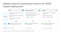

# Address internal oversharing concerns in Microsoft 365 Copilot deployment blueprint

[Microsoft 365 Copilot](microsoft-365-copilot-overview.md) works with different Microsoft services to help you get your data ready for Copilot.

For Copilot administrators, it can be overwhelming to know where to start. Existing administrators can also be unfamiliar with how some features can enhance their data security.

To address the need for shorter, actionable, and prescriptive guidance, you can use this deployment blueprint.

In this deployment blueprint, we provide a recommended approach to address internal oversharing concerns throughout a Microsoft 365 Copilot deployment.

The blueprint breaks the deployment into three phases:

- Pilot
- Deploy
- Operate

The blueprint provides:  

- An overview of the most common causes of internal oversharing in Microsoft SharePoint
- A recommended, staged approach to avoid oversharing in a Microsoft 365 Copilot deployment
- Recommended actions specific to E3 or E5 licenses at each stage
- Detailed guidance for using the tools in the SharePoint Admin Center, SharePoint Advanced Management (SAM), and Microsoft Purview to identify and mitigate oversharing and ongoing governance concerns.

:::image type="content" source="media/microsoft-365-copilot-blueprint-oversharing/blueprint-oversharing-copilot.png" alt-text="Diagram that shows oversharing blueprint for Microsoft 365 Copilot." lightbox="media/microsoft-365-copilot-blueprint-oversharing/blueprint-oversharing-copilot.png":::

## Phase 1 - Pilot

The initial stage provides steps for customers to quickly enable a Microsoft 365 Copilot pilot.

During this stage, you generate reports to identify the most frequently used and potentially overshared sites. Based on these insights, you decide to allow or restrict SharePoint sites from being accessed and searched by Copilot during testing.

The primary goal is to begin the Copilot deployment with a limited group of users. And later, expand iteratively based on the generated reports and learnings.

## Phase 2 - Deploy

The second stage, Deploy at scale, helps customers in fully deploying Copilot across the entire organization.

This stage focuses on identifying oversharing risks and restricting Copilot's access to and processing of sensitive information.

During this stage, the overall data security posture is improved by ensuring organizational controls are set to avoid unintentional oversharing and to increase visibility into potential security gaps.

## Phase 3 - Operate

The third stage aims to mitigate risks and streamline oversight by regularly generating oversharing reports and implementing corrective actions.

It also focuses on:

- Enhancing the security of sensitive data through automatic labeling
- Improving Copilot responses by reducing data volume and minimizing the potential for oversharing

## Download the blueprint and documentation

| Deployment model | Description |
|---|---|
|**Address oversharing in Microsoft 365 Copilot**      Updated November 2024 | Use this deployment model to assist organizations in identifying and mitigating internal oversharing risks.   **This model includes** <ul><li>Blueprint with high level activities and presentation [PDF](https://aka.ms/Copilot/OversharingBlueprintPDF) \| [PowerPoint](https://aka.ms/Copilot/OversharingBlueprintPPT)</li></ul> |

### Documentation resources

- [E3 customers – prepare your data for Copilot](microsoft-365-copilot-e3-guide.md)

  Learn how to use the features included in your E3 license to prepare your data for Microsoft 365 Copilot.

- [E5 customers – prepare your data for Copilot](microsoft-365-copilot-e5-guide.md)

  Learn how to use the features included in your E5 license to prepare your data for Microsoft 365 Copilot.

## Related content

- [Microsoft Purview blueprint: Secure by default](/purview/deploymentmodels/depmod-securebydefault-intro)
