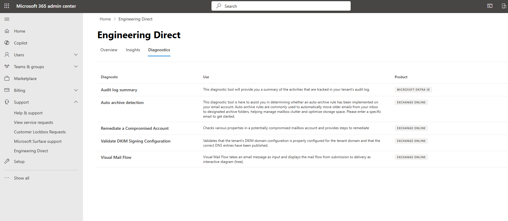
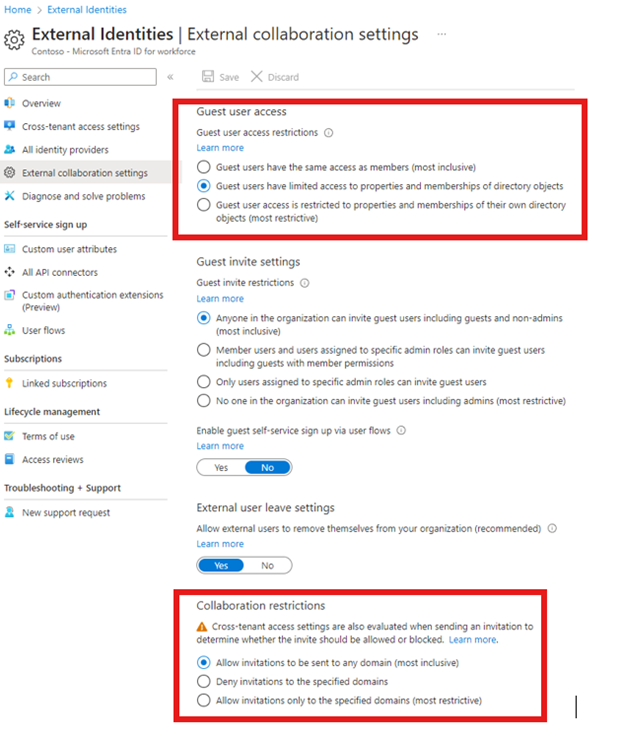
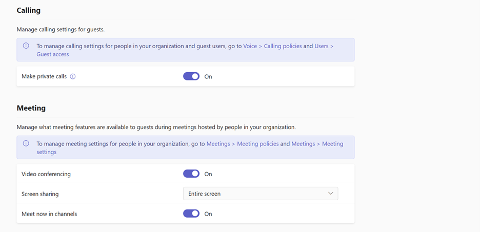
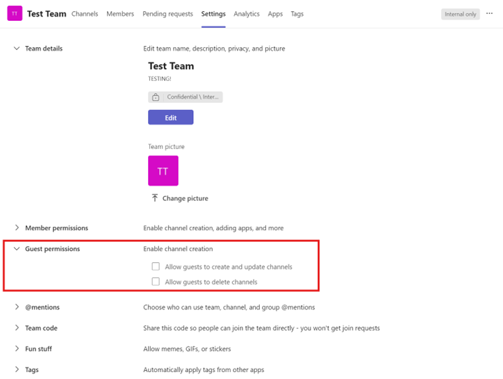

  # Engineering Direct Portal in the Microsoft 365 Admin Center

The Engineering Direct Portal is a new feature within the Microsoft 365 admin center designed to provide Office Engineering Direct (OED) customers with an enhanced engineering experience. This article provides an overview of the portal's features, how to access it, and its functionality.

The Engineering Direct Portal offers:

- Delivery metrics to help highlight what OED provides and how you use the service
- Insight into support tickets that have been raised to the product group
- Self-service diagnostics to empower you with immediate insights and resolutions
- Features and diagnostics suggested by our OED customers

> [!NOTE]
> The portal is available to all OED customers and their in-scope tenants at no additional charge. Permissions are currently granted to anyone within your tenant with an RBAC (role-based access control) **support** role.

## Accessing the Engineering Direct Portal

The Engineering Direct Portal is located under **Support** within the Microsoft 365 admin center. To access the portal, follow these steps:

1. Navigate to the Microsoft 365 admin center.
1. Select **Support**.
1. Select **Engineering Direct** to enter the portal.

## Overview Page

Once in the portal, you'll see the **Overview** page. This page contains several key elements:

- **ACE Contact**: If you have an Advanced Cloud Engineer (ACE) assigned, you'll see an ACE tile with primary contact information. This lists your ACE email address with a clickable option to start an email. The tile won't be visible to customers without an ACE.
- **Insights: Key Metrics**: This tile lists both your engineering escalations and those escalations that have been resolved for the last six months. An issue is considered an 'engineering escalation' once it has been raised to and assigned to a Microsoft Engineering team member (either through our support organization, or through your usage of the "Escalate to Engineering" feature).
  - Total escalations include open or closed tickets
  - Active escalations include only those tickets that are open
- **Customer Advisory Board (CAB)**: The CAB tile will list the last and next CAB events as well as the last and next community calls. This is informational only; registrations and calendar blockers will continue to be provided separately through existing process channels.
- **Insights: Escalation Trend Per Week by Status**: A monthly view of escalations by open and closed for the last six months. This is a focused view of all reactive issues, filtered by all issues that have a Microsoft engineering element.
- **Request A Feature**: Allows you to submit feedback or a request to the Engineering Direct Portal team. Feedback can be both related to the portal itself and its functionality, and any broader engineering features you would like to see in Engineering Direct. Feature requests submitted via this method are visible to users in your private **MyFeedback** section of the feedback portal.

## Insights Page

The **Insights** page provides detailed metrics, visuals, and lists on both your current engineering tickets and those that have been resolved within the last six months. This could be through support or through the "Escalate to Engineering" feature. The layout of this page might differ from the screenshot. This page contains:

1. **Total escalation metrics** – Cumulative total of tickets escalated to product groups in the last six months.
2. **Escalate to Engineering** - Cumulative total of tickets using the Escalate to Engineering feature in the last six months.
3. **Escalations by product** – Active engineering tickets to the product groups by service product.
4. **Escalation trend per week by status** – Monthly view of open or closed tickets escalated to the product groups.
5. **Support vs. Escalate to Engineering** – Visual showcasing active tickets escalated to engineering either via support or the Escalate to Engineering feature. The number in the center represents the current total active tickets.
6. **Distribution of escalation severity** – Visual of tickets escalated to the product groups by severity.
7. **Service Requests Escalated to engineering** – List view with filters of tickets that have been escalated to product groups:

    - **Title** – support ticket title
    - **Created By** – individual who opened the support ticket
    - **Ticket #** – support ticket number
    - **Severity** – ticket severity
    - **Escalation date** – date the issue was first escalated to the product groups
    - **Status** – status of the ticket escalated to the product groups. Status lists open or closed to start.
    - **Escalate to Engineering – true or false** - represents whether the customer raised the issue directly to engineering
    - **Product** – service product

## Diagnostics Page

The **Diagnostics** page hosts diagnostic tools for self-service issue resolution within your environment.

In this section:

- [Visual Mail Flow](#visual-mail-flow)
- [Validate DKIM Signing Configuration](#validate-dkim-signing-configuration)
- [Auto Archive Detection](#auto-archive-detection)
- [Remediate a Compromised Account](#remediate-a-compromised-account)

- [Audit Log Summary](#audit-log-summary)

<!---
- [Guest Access in Teams](#guest-access-in-teams)
- -->

### Visual Mail Flow

Visual Mail Flow enables you to examine issues related to mail flow, such as email submission, group expansion, processing by transport agents (such as AntiSpam, mail flow rules, Data Loss Prevention), and delivery.

Some common situations where Visual Mail Flow can be useful:

- Checking the delivery status of recipients
- Determining reasons for nonreceipt of emails by certain recipients
- Understanding variations in email delivery between recipients
- Identifying mail flow rules applied to an email and their actions
- Identifying Data Loss Prevention rules applied to an email and their actions

#### Input Requirements

To use Visual Mail Flow, you need either the email's Message ID *or* the Network Message ID. You can locate either the message ID or the network message ID by opening the email in question, go to **File** -> **Properties** -> **Internet headers**. You can parse through the headers to find either the message ID or network ID. Alternatively, you can copy/paste the entire internet header box and use a tool like [Message Header Analyzer](https://mha.azurewebsites.net/) to parse this information for you.

> [!NOTE]
> Ensure the submitted messages are within the age range of 1 to 90 days.

- **Message ID**: Found in the email header with the "Message-ID:" token. Users can provide this information to help investigate specific messages. Be sure to include the full message ID. This might include angle brackets (<>). Although the form varies depending on the email system, here's an example of what a message ID would look like: `<08f1e0f806a47b4ac109109ae6ef@server.domain>`.
- **Network Message ID**: Found in the email header with the "X-MS-Exchange-Organization-Network-Message-Id:" token. An example of a network message ID is `4d4c1224-7398-4e8e-949f-ce1932c4ab9d`.

#### Running the Diagnostic

Enter either the Message ID or Network Message ID, then select **Troubleshoot** to start the diagnosis. Results are generated in approximately 30 seconds.

#### Understanding the Results

The Visual Mail Flow diagnostic result includes:

- **Summary**: General conclusion on the mail flow.
- **Highlights**: List of outstanding info and detected issues.
- **Recommendations**: Intelligent recommendations for resolving detected issues.

The **Visual Mail Flow Tree** is an interactive display showing the stages an email went through, with the ability to zoom, drag, and view detailed node information. By examining the tree, you can gain a detailed understanding of how Exchange Online processed the email. In some cases, you might notice that the tree node is split into multiple child nodes. This is due to Exchange Online's bifurcation feature, which separates recipients into multiple sets to process them separately during mail flow.

#### Investigating Further

Select a tree node to view a flyout with other details, including recipients processed and node-specific properties for troubleshooting mail flow issues. The flyout contains other details for you to review and investigate. It contains a common “Recipients” property to show which recipients this node processed, and more node-specific properties that vary between nodes to help better troubleshoot mail flow issues.

> [!TIP]
> Emails sent to many recipients or large groups will take a longer time to query or could time out. Querying emails with fewer recipients could improve your experience.

If Visual Mail Flow can’t help you resolve the issue, contact Microsoft Support for further help.

### Validate DKIM Signing Configuration

The Validate DKIM (DomainKeys Identified Mail) Signing Configuration tool in Microsoft Admin Center is designed to help administrators verify and troubleshoot DKIM configurations for their domain. DKIM is an email authentication method that enhances email security by allowing receiving mail servers to verify the authenticity of the sender's email through a digital signature. This verification process helps prevent email spoofing and ensures the integrity of the message. 

The Validate DKIM Signing Configuration tool is used to: 

- Validate the DKIM signing configuration for a domain. 
- Identify issues with DKIM setup, such as missing, incorrect, or improperly enabled configurations. 
- Provide actionable insights to help resolve configuration issues and ensure email messages are properly authenticated and trusted by recipient systems. 

#### Scenarios for Use

This diagnostic tool is particularly useful in the following scenarios: 

- **Initial Setup:** After configuring DKIM for a new domain, use the tool to verify that the setup is complete and correct. 
- **Troubleshooting:** If emails from your domain are being marked as spam or aren't passing DKIM validation, use the tool to diagnose potential configuration issues. 
- **Configuration Updates:** When updating DKIM settings or DNS records, use the tool to confirm that changes have been applied correctly. 

#### Steps and Outputs

- **Step 1: Access the Validate DKIM Signing Configuration Tool**

  Navigate to Microsoft Admin Center: 

    - Sign in to the Microsoft Admin Center. 
    - Go to the Diagnostics section. 

  Select Validate DKIM Signing Configuration: 

    - Choose the Validate DKIM Signing Configuration tool from the list of available diagnostics. 

- **Step 2: Input Required Information**

  Tenant: 

    - The tool will automatically pull the default tenant information from the HTML. 

  Vanity Domain: 

    - Select the domain you want to test from the dropdown list of available domains. 

- **Step 3: Review Diagnostic Results**

  After running the diagnostic, you'll receive one of the following results, depending on the status of your DKIM configuration: 

  **Slide 1: No Configuration Created nor Enabled**

    - Description: DKIM signing configuration for the domain hasn't been created. Emails might use default domain settings. 
    - Action Required: Create the necessary DKIM signing configuration. Follow the PowerShell link provided in the diagnostic output to create the configuration. Then, configure DKIM using the steps outlined in the [Set up DKIM to sign mail from your Microsoft 365 domain](/defender-office-365/email-authentication-dkim-configure) article. 

  **Slide 2: Configured but Possibly Published Incorrectly**

    - Description: DKIM configuration entries for the domain are either not published or published incorrectly. 
    - Action Required: Check the DNS entries for errors. Ensure that CNAME records correctly point to the Microsoft published public key entry as specified in the DKIM configuration. Correct any issues with the CNAME publishing and refer to the [Set up DKIM to sign mail from your Microsoft 365 domain](/defender-office-365/email-authentication-dkim-configure) article for further instructions. 

  **Slide 3: Created but Not Enabled**

    - Description: DKIM signing configuration for the domain has been created but not yet enabled. 
    - Action Required: Enable DKIM signing for the domain. Follow the steps in the [Set up DKIM to sign mail from your Microsoft 365 domain](/defender-office-365/email-authentication-dkim-configure) article to enable and validate the configuration. 

  **Slide 4: Properly Created and Correct DNS Entries Enabled**

    - Description: DKIM signing configuration is correctly created and enabled with accurate DNS entries. 
    - Action Required: No further action is required. Your DKIM configuration is properly set up, and your emails should be authenticated correctly by recipient systems. 

#### Troubleshooting and Support

If you encounter issues with the Validate DKIM Signing Configuration tool or need further assistance, consider the following steps: 

- The diagnostic output includes specific details about configuration errors. Use these details to pinpoint and correct issues. 
- Refer to the [Set up DKIM to sign mail from your Microsoft 365 domain](/defender-office-365/email-authentication-dkim-configure) article for comprehensive guidance on DKIM configuration. 
- If issues persist, contact Microsoft support for further assistance. 

By using the Validate DKIM Signing Configuration tool effectively, you can ensure that your email authentication is robust and that your messages are protected from spoofing and tampering.

### Auto Archive Detection

Auto Archive Detection helps manage your mailbox by automatically archiving or deleting old items. This feature can be configured differently in Outlook Desktop and Outlook on the Web (OWA). Editing Auto Archive settings in Outlook can help you effectively manage your mailbox, keeping it organized and free of clutter. Whether you're using Outlook Desktop or Outlook on the Web, the steps provided will guide you through the process of configuring Auto Archive to suit your needs.

Follow the following steps to enable and customize Auto Archive settings based on your version of Outlook. 

#### For Outlook Desktop

1. Launch the Outlook application on your computer.
1. Click on the **File** tab located in the top left corner of the window.
1. From the menu that appears, select **Options**.
1. In the Outlook Options window, click on **Advanced** found in the left sidebar.
1. Under the "AutoArchive" section, click on **AutoArchive Settings**.
1. Configure AutoArchive:

    - Run AutoArchive every X days: Check this box and set the frequency for how often you want Auto Archive to run. 
    - Prompt before AutoArchive runs: If you wish to receive a reminder before Auto Archive runs, check this option. 
    - Delete expired items: Check this box if you want to permanently delete old items.

1. Choose Actions: Decide what actions you want Auto Archive to take:

    - Move items to the archive folder: Archives items in a designated folder.
    - Permanently delete old items: Removes items without archiving.
    - Archive items older than a specific number of months: Specify the age of items to be archived.

1. Set Archive Folder: Specify the folder where you want archived items to be stored.

1. After making your selections, click **OK** to save your settings. Click **OK** again to exit the Options window.

#### For Outlook on the Web (OWA)

1. Navigate to your Outlook on the web and sign in with your credentials. 

1. Click on the gear icon in the top right corner to open the settings menu. 

1. At the bottom of the settings panel, click on **View all Outlook settings**. 

1. In the settings window, select **Mail**, then go to **Cleanup**. 

1. Locate the Auto Archive settings and configure them according to your preferences. 

1. Save your changes to apply the new settings. 

### Remediate a Compromised Account

If you or your user suspects an account has been accessed by someone who shouldn’t have access, it may be compromised. The **Remediate a Compromised Account** diagnostic will help you check different aspects of the affected mailbox and guide you through the steps to recover the account. Please use this diagnostic if you or your user notice any signs that one of your user's accounts may have been compromised.

This diagnostic is split into multiple sections that detail steps to remediate the account. Each step lists the actions required or links to an article that can be explained in more detail. Furthermore, there will be additional account details for each step, such as when the user last reset the password, what MFA is enabled on the account, and which IP addresses have accessed the mailbox.

**Inputs**

- Email Address of Compromised Account

#### Steps and Output

1. Force Sign Out - First, it is important to force a user to sign out of all sessions:

    - Go to the [Microsoft 365 admin center](https://admin.microsoft.com/Adminportal/Home#/homepage).

    - Navigate to _Users > Active users_.

    - Click on the desired user.

    - On the Account Tab, under _Sign-out_, select _Sign out of all sessions_.

2. Reset Password - [Reset the password.](/microsoft-365/admin/add-users/reset-passwords) Don't send the new password to the user through email, because the attacker may still have access to the mailbox. Be sure to use a strong and unique password: upper and lowercase letters, at least one number, and at least one special character.

    - The last time a user reset the password will be displayed.

3. Enable multifactor authentication - [Multi-Factor Authentication (MFA)](/entra/identity/authentication/concept-mfa-howitworks) is crucial for enhancing security and protecting user accounts. [Enable MFA](/microsoft-365/admin/security-and-compliance/set-up-multi-factor-authentication).

    - A list of types of MFA enabled on the user will be displayed.

4. Block Suspicious IP Addresses - Blocking suspicious or harmful IP addresses is an essential cybersecurity measure. [Review the IP Addresses that have activity on this account and block any that are suspicious](/defender-office-365/tenant-allow-block-list-urls-configure).

    - A list of IP addresses that performed actions on the account will be displayed.

5. Remove Account from Administrative Roles - To ensure that the attacker can't perform administrative actions, [remove compromised account from any administrative roles](/microsoft-365/admin/add-users/assign-admin-roles?WT.mc_id=365AdminCSH_SupportCentral). You can restore the user's membership once the account is secured.

6. Enable Mailbox Logging - Mailbox logging is the capability of capturing and analyzing audit logs related to security, compliance, and other activities within Microsoft 365 or Office 365. [Enable mailbox logging.](/purview/audit-log-enable-disable?tabs=microsoft-purview-portal)

    - The status of logging on the mailbox will be shown (Enabled or Disabled).

7. Remove Unusual Mailbox Delegates - A mailbox delegate is someone you authorize to manage your email and calendar on your behalf. Displayed below are all the delegates that aren't the mailbox owner. [Delete any unknown users.](/exchange/recipients-in-exchange-online/manage-permissions-for-recipients)

    - Users who have delegate permission will be displayed with the fields `user (email)`, `isinherited`, and `access rights`.

8. Remove Unusual Inbox Rules - Inbox rules are often used by attackers to forward emails to themselves. [Check if there are any unusual rules and delete them.](/exchange/security-and-compliance/mail-flow-rules/manage-mail-flow-rules)

    - The inbox rules registered on the mailbox will be displayed with the identity, name, description, `forwardto` address, and enabled status.

9. Remove Unusual SMTP Forwarding - Simple Mail Transfer Protocol (SMTP) is the protocol responsible for sending emails from the sender's email client to the email server. [Check if there is SMTP forwarding.](/exchange/recipients-in-exchange-online/manage-user-mailboxes/manage-user-mailboxes)

    - SMTP forwarding registered on the mailbox will be displayed.

10. Remove Unusual Accepted Domains - An accepted domain in a mailbox allows users in a domain to send and receive mail. [Delete any unusual domains.](/exchange/mail-flow-best-practices/manage-accepted-domains/manage-accepted-domains)

    - Accepted domains registered on the tenant will be displayed.

11. Remove Unusual Inbound and Outbound Connectors - Inbound connectors manage email traffic coming into your organization, while outbound connectors control the flow of emails leaving your organization. [Check if there are any unusual connectors and delete them.](/exchange/mail-flow-best-practices/use-connectors-to-configure-mail-flow/set-up-connectors-to-route-mail)

    - Connectors registered on the tenant will be displayed.

**Further Steps**

If the user still shows signs of being compromised, reach out to Microsoft Support for further help.

### Audit Log Summary

The audit log summary provides a comprehensive overview or count of the activities tracked within your tenant’s audit log. This diagnostic tool is useful for reviewing admin actions, identifying unusual administrative activity, or investigating potential rogue administrators. 

#### Inputs 

- Search the number of days prior to the current date (max 30 days)

  - If you enter 10, the diagnostic will review the log for up to 10 days prior to the current date
  
  - If left blank, the diagnostic will run with the value of 7 days 
  
#### Outputs 

The output is split into two sections: 

1. Users with High Activity – Users who have performed a specific action at a much higher rate than the average user will be listed here, along with the count of each action they have taken. 

1. Full User List – All users, along with a list of their activities and corresponding counts, will be displayed here in alphabetical order. Actions performed by apps will be grouped together. 

<!---
### Guest Access in Teams

The **Guest Access Diagnostic for Microsoft Teams** helps troubleshoot various issues that may hinder guests from accessing a team, such as inviting guests, accessing team content, and using specific guest features. Since guest settings are managed at both organizational and team levels, this diagnostic checks for any misconfigurations that could impact guest access. It aggregates these issues and presents them in one place, with each misconfigured setting accompanied by guidance for admins. Additionally, the diagnostic assesses the provisioning of guest user accounts. It also allows for optional inputs at org, team and user levels, giving you the flexibility to customize the output you receive.

#### Org-level settings

These settings at the organization level are evaluated to check for misconfiguration.  

|Setting|Where it's located|Setting values considered “misconfigured”|
| -------- | -------- | -------- |
|External collaboration setting's guest invite setting|Microsoft Entra Admin Center |<li>No one in this organization can invite guest users including admins (most restrictive)</li><li>Only users assigned to specific admin roles can invite guests</li> |
|M365 group guest setting|Microsoft Admin Center |Either one or both of these settings are turned off:<li>Let group owners add people outside your organization to Microsoft 365 Groups as guests</li><li>Let guest group members access group content</li> |
|SharePoint External Sharing settings |SharePoint Admin Center |<li>Only people in your organization</li><li>Existing guests only</li> |
|Guest Access setting |Teams Admin Center |Off |

#### User-level setup

This diagnostic checks the guest user account provisioning in both Entra and Teams when a guest user is provided as input. If a Teams team is also specified, it will verify the guest user's membership in that team. 

#### Additional settings

In addition, this diagnostic also displays some settings that could affect your guest access experience. These settings are not evaluated for misconfiguration.  

1. Guest user access restriction setting and collaboration restrictions setting in Microsoft Entra Admin Center 

       

2. Guest feature settings in Teams Admin Center 

       

3. Teams guest permissions in Teams app 

     

This diagnostic should assist to resolve your guest access issues and provide a seamless guest experience in Teams.  

If problems persist, reach out to Microsoft support for assistance. 
-->

## More information

As we roll out new features, your experience might change.

If you would like to get help or have questions, reach out to [edfeedback@microsoft.com](mailto:edfeedback@microsoft.com) or use the feedback mechanism within the Engineering Direct Portal page. If you're encountering any technical issues, open a support ticket via your normal support channel.
