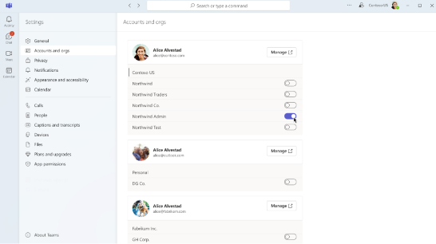

# Multitenant org FAQ

Read about frequently asked questions for Microsoft multitenant organizations. These frequently asked questions (FAQs) are periodically updated to include new articles.

## MTO lifecycle

### How is a multitenant organization (MTO) set-up?

Administrators create an [MTO](https://techcommunity.microsoft.com/blog/microsoft_365blog/multi-tenant-organization-capabilities-now-available-in-microsoft-365/4122812) in the Microsoft 365 admin center and configure collaboration capabilities for users across the tenants. [MTO configuration](/microsoft-365/enterprise/plan-multi-tenant-org-overview) includes the creation of cross-tenant sync jobs. 

### Are cross-tenant sync jobs auto generated when an MTO is created?

When an MTO is created or a tenant joins an existing one, cross-tenant sync jobs are autogenerated to enable sync between any existing tenants and the new one. However, these jobs start executing periodically only after a tenant admin shares users to be synced across the MTO.

### Can existing cross-tenant sync jobs created in the Entra ID portal be used?

Existing cross-tenant sync jobs with B2B collaboration members can be used instead of the ones automatically created when you set up an MTO. These existing B2B members will be able to use MTO features after the MTO is created. 

### Can I delete the auto-generated MTO_Sync job created during MTO setup?  

When an MTO is created, it generates cross-tenant sync jobs with the prefix "MTO_Sync" that can be seen in the Entra ID Portal. These jobs can be deleted but then might be recreated automatically, which can be safely ignored.

### What happens to the cross-tenant sync jobs when a tenant leaves an MTO? 

Cross-tenant sync jobs are unaffected when leaving an MTO. We recommend that administrators review their cross-tenant syncs, [cross-tenant sync setting](/entra/identity/multi-tenant-organizations/cross-tenant-synchronization-overview#cross-tenant-synchronization-setting), and [automatic redemption setting](/entra/identity/multi-tenant-organizations/cross-tenant-synchronization-overview#automatic-redemption-setting) when a tenant leaves an MTO. 

### What happens when a synced user already exists on as a B2B user on the target tenant? 

B2B guest users won't be affected by the MTO creation and their experience won't change. If you want existing guests to experience MTO features, they need to be [converted](/entra/external-id/user-properties#convert-usertype) to member users.  

If the user exists as a B2B member, they'll automatically experience MTO capabilities upon MTO creation. 

### What happens when a synced user already exists as a contact on the target tenant? 

The contact objects remain unaffected by the creation of an MTO or cross-tenant sync jobs. Cross-tenant sync creates B2B member objects which might cause duplicate entries to show when the user is searched for. We recommend cleaning up main contacts before implementing MTO. [Common considerations for multitenant user management in Microsoft Entra ID - Microsoft Entra | Microsoft Learn](/entra/architecture/multi-tenant-common-considerations#issues-with-using-mail-contact-objects-instead-of-external-users-or-members) 

### Can security groups be synced across tenants?

While groups can be used to sync users across tenants via Entra cross-tenant sync, the security groups themselves can't be synced across tenants. 

### Can source attributes be mapped to different attributes on the target tenant?

Yes, you can [customize](/entra/identity/multi-tenant-organizations/cross-tenant-synchronization-configure#step-9-review-attribute-mappings) your attribute mappings. 

### How should "Visible to Users" property be set for the cross-tenant sync jobs?

This setting is available in the cross-tenant sync job properties in the Microsoft Entra ID portal. The property determines if the app shows up on end user portals like myapps.microsoft.com. It's recommended that "Visible to Users" is set to No for sync jobs.  

### Can MTO users register applications in Microsoft Entra ID in other tenants? 

This depends on what roles can register apps. We recommend restricting to the app developer role.

### Can the access permissions of the MTO user be restricted? 

Use [Conditional Access](/entra/identity/conditional-access/overview) policies to restrict access to MTO users similar to other provisioned users.   

### Can an MTO be created across worldwide geographies?  

An MTO can span tenants in multiple locations if they are in the **same** cloud. However, an MTO can't be set up between tenants that are located in different cloud environments. For instance, if you have a tenant in the commercial cloud and another in GCCH, creating an MTO between them isn't supported yet. 

### Is MTO available in special clouds? And can I set up MTO between my cloud tenants? 

MTO is available within GCC, GCC-H, and DOD clouds. However, the MTO tenants can ONLY have tenants which are within the **same** cloud. 

### What is the MTO licensing requirement?

Use of the multitenant organization feature requires a user to have Microsoft Entra ID P1 licenses or above. For more information, see [Entra multitenant organization licensing requirements](/entra/identity/multi-tenant-organizations/multi-tenant-organization-overview#license-requirements) and [Entra cross-tenant sync licensing requirements](/entra/identity/multi-tenant-organizations/cross-tenant-synchronization-overview#license-requirements). 

The guiding principle is that one human only needs one license. So, if you're licensed in your home tenant, you don’t need an another license on the resource tenant.  

## Teams

### Is cross-tenant sync setup sufficient to leverage MTO functionality on Teams?

MTO-specific Teams functionality requires an MTO to be set up. [External access](/microsoft-365/enterprise/plan-multi-tenant-org-overview#trusted-organizations-in-external-access) policy setup and [B2B direct connect](/microsoft-365/enterprise/plan-multi-tenant-org-overview#shared-channels-in-multitenant-organizations) policy setup that is part of the MTO setup is essential to leverage MTO functionality on Teams. Learn more about Teams multitenant capabilities [here](https://techcommunity.microsoft.com/t5/microsoft-teams-blog/announcing-more-seamless-collaboration-in-microsoft-teams-for/ba-p/3901092). It's important to keep in mind that these capabilities are only available on the mobile (iOS and Android) and new Teams desktop client. The customers using web client wouldn't see any benefits or optimized experience for MTO. 

### Do old chats get merged when a user is converted from a B2B guest to a member? 

Old chats aren't merged when a user is converted from a guest to a member. The user still sees the chat thread with B2B members, however, sending new chat messages in that thread is blocked. All search entry points will redirect the user to chat with home tenant ID of the user from broader MTO group and chats going forward won't fragment.

### Can MTO users create Teams and invite guests on other tenants? 

MTO users can create teams and invite guests from other tenants. 

### Why are some users unable to see their home tenants after a tenant switch to MTO tenant?

This is a known issue that might impact a small set of users. Microsoft is working on a fix that would be rolling out soon. Reach out to Microsoft support if users in your organization are impacted. 

### Does MTO work when using Teams on the web? 

Microsoft Teams on the web isn't currently supported in an MTO. However, a version of the Teams web app is being optimized for MTO features in the future.

### A few users are unable to see all MTO tenants in the drop-down. Is this expected?

It's possible that some users won’t see all MTO tenants in the account picker drop-down. When this happens, navigate to Accounts and orgs tab in the app settings on the new Teams desktop client. Turn on toggle next to the org you want to show in the account picker. 

### Is the org chart and profile picture visible for MTO users? 

The org chart and profile picture are available for MTO users and can be viewed in Teams. We do recommend using cross-tenant sync to sync all user properties including the manager attribute.

### Is the profile picture visible for MTO users?

The profile picture is visible for MTO users in Teams. However, it isn't yet available in other clients. The profile picture is made available through a Teams feature and not through cross-tenant sync. 

### What meeting join experience is offered to users joining a meeting hosted on a different tenant?

Users are automatically redirected to use their B2B member identity in the meeting host tenant to join the meeting. When tenants have MFA requirements that enforce users to verify their account status, the system might default to their home tenant identity. For such cases, we recommend users change and pick their B2B member account on the host tenant. This can be done on the meeting pre-join screen before joining the meeting. 

### What chat and meeting artifacts are available to MTO users?

Users who joined the meeting using their B2B member identity can view meeting chat and other meeting artifacts (including meeting recordings/transcripts) by using their B2B member identity in the meeting host tenant (tenant switch would be required). 

### Can Teams rooms or conference rooms be booked in an MTO?

Teams and conference room booking across tenants aren't yet supported in an MTO.  

### Can I still use Teams Federation with MTO?

There's no impact on Teams Federation. Customers are still able to chat via that method. MTO would make Teams chat easier by providing a more seamless People search and centralized chat notification experience within the MTO group.

## SharePoint Online (SPO) 

### Are org shareable links visible to all MTO users by default? Can this be restricted?

Org Shareable links or “Anyone in my organization” links are redeemable by all MTO users since MTO users are B2B member users. However, the link would have to be shared with the MTO user somehow, whether that is by chat, email or on a document somewhere etc. 

### What changes occur in Teams when a B2B guest user is converted to a member after MTO creation?

When a B2B guest user is converted to a member, they can leverage MTO experiences. Users that previously had guest access to a file don't lose access once their account is converted to a member. 

### Attributes for some users aren't accurate on the SharePoint sites. Is this a known issue?

Cached SPUser records in specific SPO/ODC sites or attributes for the user records such as UserType aren't automatically updated from Microsoft Entra ID when changes are made via MTO formation. We currently rely on a timer job to update these records in the short term with a long-term solution for a dynamic sync with Entra in progress. Tenants who formed an MTO before the short-term solution rolled out across all farms may run into access denied issues. If access denied issues are consistently occurring, reach out the Microsoft Support team to initiate the manual process to resolve the gaps. 

