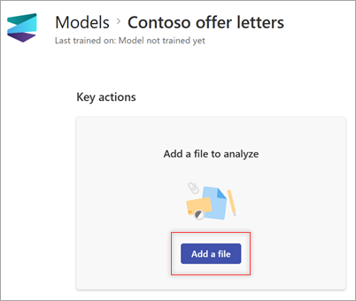
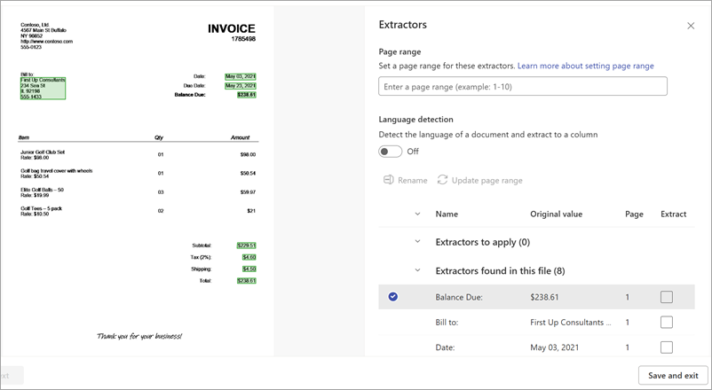
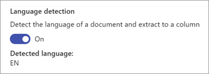

# Use a prebuilt model to extract information from simple documents in Microsoft Syntex

The *simple document processing model* offers a flexible, pretrained solution for extracting information from [basic structured documents](#types-of-documents), including information such as:

- **Key-value pairs** – Think of these like labels and their corresponding information, such as “Name: Adele Vance.”

- **Selection marks** – These are checkboxes or other marks that indicate choices or selections in a document.

- **Named entities** – These are specific items like names of people, places, or organizations mentioned in the text of a document.

- **Barcodes** – These are machine-readable representations of data that can be used for tracking or identification purposes in a document.

Unlike other prebuilt models with fixed schemas, this model can identify keys that others might miss, providing a valuable alternative to custom model labeling and training. This model also supports barcodes and language detection.

### Types of documents

Simple document processing works best with the types of documents that contain structured information, such as:

- **Forms** – These often have clear fields and labels, making it easier to extract key-value pairs.

- **Invoices** – Typically include consistent layouts with tables and key-value pairs.

- **Receipts** – Similar to invoices, they have structured data that can be easily extracted.

- **Contracts** – Contain well-defined sections and clauses that can be parsed effectively.

- **Bank statements** – Include tables and structured data that are ideal for extraction.

These documents benefit from the optical character recognition (OCR) capabilities and deep learning processes used to extract key-value pairs, selection marks, tables, and named entities.

> [!NOTE]
> Currently, this model is available for .pdf and image file types and in more than 100 languages. More supported file types will be added in future releases.

To use a simple document processing model, follow these steps:

- Step 1: [Create the model](#step-1-create-the-model)
- Step 2: [Upload an example file to analyze](#step-2-upload-an-example-file-to-analyze)
- Step 3: [Select extractors for your model](#step-3-select-extractors-for-your-model)
- Step 4: [Apply the model](#step-4-apply-the-model)

## Step 1: Create the model

Follow the instructions in [Create a model in Syntex](create-syntex-model.md#create-a-prebuilt-model) to create a simple document processing model. Then continue with the following steps to complete your model.
<!---
Follow the instructions in [Create a model in Syntex](create-syntex-model.md#create-a-prebuilt-model) to create a simple document processing model. Then continue with the following steps to complete your model.
--->
## Step 2: Upload an example file to analyze

1. On the **Models** page, in the **Add a file to analyze** section, select **Add a file**.

    

2. On the **Files to analyze the model** page, select **Add** to find the file you want to use.

    

3. On the **Add a file from the training files library** page, select the file, and then select **Add**.

     

4. On the **Files to analyze the model** page, select **Next**.

## Step 3: Select extractors for your model

On the extractor details page, you see the document area on the right of the page and the **Extractors** panel on the left. The **Extractors** panel shows the list of extractors that have been identified in the document.

   

The entity fields that are highlighted in green in the document area are the items that were detected by the model when it analyzed the file. When you select an entity to extract, the highlighted field changes to blue. If you later decide not to include the entity, the highlighted field changes to gray. The highlights make it easier to see the current state of the extractors you select.

> [!TIP]
> To zoom in or out to read the entity fields, use your mouse’s scroll wheel or the zoom controls at the bottom of the document area.

### Select an extractor entity

You can select an extractor either from the document area or from the **Extractors** panel, depending on your preference.

- To select an extractor from the document area, select the entity field.
<!--
     
--->
- To select an extractor from the **Extractors** panel, in the **Extract** column, select the corresponding checkbox to the right of the entity name.
<!---
     
--->
When you select an extractor, the **Select extractor?** box is displayed in the document area. The box shows the key name (the name generated for the extractor), the detected value (the value of that field in the document), the column type, and the option to select the entity as an extractor.

   

The key name is used as the column name when the model is applied to a SharePoint library. You can change the key name to be more descriptive if you like. The column type shows how the information is displayed in a library. You can change the column type to show how you want the information displayed. When the model is applied to a library, you can use column formatting to specify how you want it to look in the document.

Continue to select other extractors you want to you use. You can also add other files to analyze for this model configuration.

### Rename an extractor

There are three ways you can rename an extractor:

- In the document area of the extractor details page, select the entity field. On the **Select extractor?** box, in the **Key name** field, enter a new name for the extractor.

- On the **Extractors** panel of the extractor details page, select the extractor you want to rename, and then select **Rename**.

- From the model home page, in the **Extractors** section, select the extractor you want to rename, and then select **Rename**.
<!---
To rename an extractor from the model home page :

1. In the **Extractors** section of the extractor details page, select the extractor you want to rename, and then select **Rename**.

     

2. On the **Rename entity extractor** panel, enter the new name of the extractor, and then select **Rename**.

To rename an extractor from the **Extractors** panel:

1. Select the extractor you want to rename, and then select **Rename**.

     

2. In the **Rename extractor** box, enter the new name of the extractor, and then select **Rename**.
--->

### Set a page range for processing

For this model, you can specify to process a range of pages for a file rather than the entire file. On the **Extractors** panel, in the **Page range** section, select the page you want processed. By default, the **Page range** setting is empty. If no page range is provided, the entire document is processed. For more information, see [Set a page range to extract information from specific pages](page-range.md).

### Detect the language of a document

For this model, you can detect the language of a document and extract it to a column. On the **Extractors** panel, in the **Language detection** section, toggle to turn on language detection. It shows you the ISO code the detected language.

   

You also can turn on or off language detection from the **Model settings** panel for the model.

## Step 4: Apply the model

- To save changes and return to the model home page, on the **Extractors** panel, select **Save and exit**.

- If you're ready to apply the model to a library, in the document area, select **Next**. On the **Add to library** panel, choose the library to which you want to add the model, and then select **Add**.

